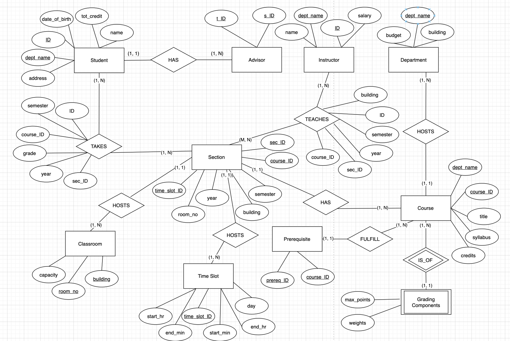
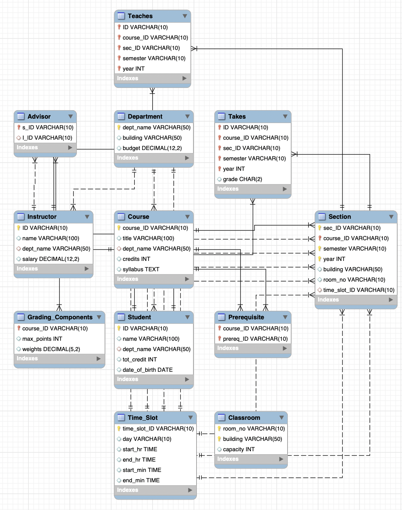

# University-Academic-Management-System (UAMS)


## 🔆 Introduction

The university currently utilizes several disjointed systems for its academic management needs. This fragmentation leads to inefficiencies in academic record maintenance, scheduling, and resource management, making the processes cumbersome and error-prone. The proposed University Academic Management System (UAMS) aims to centralize and streamline the management of academic records, course scheduling, faculty assignments, and classroom allocations. By doing so, UAMS will ensure higher data integrity, improve accessibility, and enhance the decision-making capabilities of academic administrators.

---
## 🥳 Features
### Simplified Entity-Relationship Diagram (EER) Overview

The EER diagram for the UAMS outlines the following key entities and their relationships:

- **Entities:**

    1. **Student**: Represents students enrolled in the university.
    2. **Instructor**: Represents faculty members teaching courses.
    3. **Course**: Represents academic courses offered by the university.
    4. **Department**: Represents academic departments within the university.
    5. **Section**: Represents specific instances of courses offered in a semester.
    6. **Classroom**: Represents physical classrooms where sections are conducted.
    7. **Time Slot**: Represents time slots for scheduling sections.
    8. **Prerequisite**: Represents course prerequisites.
    9. **Advisor**: Represents faculty advisors for students.
    10. **Takes**: Represents student enrollment in sections.
    11. **Teaches**: Represents instructor assignments to sections.
    12. **Grading Components**: Represents grading components for courses.

                                 
 <center></center>

### Enhanced Details and Cardinalities

1. **Student**:
   - **Attributes**: `ID`, `name`, `dept_name`, `tot_cred`, `date_of_birth`, `address`.
   - **Relationships**:
     - One student can be enrolled in many sections (Takes).
     - Each student has one advisor (Advisor).

2. **Instructor**:
   - **Attributes**: `ID`, `name`, `dept_name`, `salary`.
   - **Relationships**:
     - An instructor can teach multiple sections (Teaches).
     - An instructor can be an advisor to many students (Advisor).

3. **Department**:
   - **Attributes**: `dept_name`, `building`, `budget`.
   - **Relationships**:
     - Hosts many courses and instructors.

4. **Course**:
   - **Attributes**: `course_id`, `title`, `dept_name`, `credits`, `syllabus`.
   - **Relationships**:
     - Each course can have multiple prerequisites (Prereq).
     - Each course can have multiple sections offered.

5. **Section**:
   - **Attributes**: `course_id`, `sec_id`, `semester`, `year`, `building`, `room_no`, `time_slot_id`.
   - **Relationships**:
     - Takes place in a specific classroom.
     - Occurs during a specific time slot.
     - Each section is part of a course

6. **Takes and Teaches**:
   - **Attributes**:
     - **Takes**: `ID`, `course_id`, `sec_id`, `semester`, `year`, `grade`.
     - **Teaches**: `ID`, `course_id`, `sec_id`, `semester`, `year`.
   - **Relationships**:
     - A student can take multiple sections, and each section can be taken by multiple students, forming a many-to-many relationship managed by the Takes relation.
     - An instructor can teach multiple sections, and each section can be taught by multiple instructors, forming a many-to-many relationship managed by the Teaches relation.

7. **Classroom**:
   - **Attributes**: `building`, `room_no`, `capacity`.
   - **Relationships**:
     - Hosts multiple sections.

8. **Time Slot**:
   - **Attributes**: `time_slot_id`, `day`, `start_hr`, `start_min`, `end_hr`, `end_min`.
   - **Relationships**:
     - Defines the time slots for various sections.

9. **Prerequisite (Prereq)**:
   - **Attributes**: `course_id`, `prereq_id`.
   - **Relationships**:
     - Indicates that a course (prereq_id) must be taken before another course (course_id). This is a recursive relationship on the Course entity, reflecting course prerequisites.

10. **Grading Component**:
    - **Attributes**: `max_points`, `weights`.
    - **Relationships**:
      - Each course can have multiple grading components (e.g., quizzes, exams, assignments) with different weights contributing to the final grade.

### Cardinalities
- **Student to Advisor**: One-to-One (Each student has exactly one advisor).
- **Advisor to Instructor**: Many-to-One (Each advisor is an instructor, but an instructor can advise multiple students).
- **Instructor to Department**: Many-to-One (Each instructor belongs to one department, but a department has many instructors).
- **Course to Department**: Many-to-One (Each course is offered by one department, but a department offers many courses).
- **Section to Course**: Many-to-One (Each section is a part of one course, but a course can have many sections).
- **Takes to Student**: Many-to-One (A student can take many sections, but each 'takes' record is associated with one student).
- **Takes to Section**: Many-to-One (A section can have many students enrolled, but each 'takes' record is associated with one section).
- **Teaches to Instructor**: Many-to-One (An instructor can teach many sections, but each 'teaches' record is associated with one instructor).
- **Teaches to Section**: Many-to-One (A section can be taught by many instructors, but each 'teaches' record is associated with one section).
- **Section to Classroom**: Many-to-One (A classroom can host many sections, but each section is held in one classroom).
- **Section to Time Slot**: Many-to-One (A time slot can accommodate many sections, but each section occurs during one specific time slot).
- **Prereq to Course**: Many-to-One (A course can have many prerequisites, but each prerequisite relation points to one specific course).
- **Grading Components**: Many-to-One (A course can have multiple grading components, but each component is associated with one course).


---

## Implementatin via MySQL shell

1. Login to MySQL:
```mysql
mysql -u root -p
```

2. Create a new database:
```mysql
CREATE DATABASE myuniversity;
USE myuniversity;
```
3. Create tables in the database:

```mysql
CREATE TABLE Department (
   ...
```

Describe the structure of the Students table:
```mysql
SHOW TABLES;
```
```
sql> SHOW TABLES;
+------------------------+
| Tables_in_myuniversity |
+------------------------+
| Advisor                |
| Classroom              |
| Course                 |
| Department             |
| Grading_Components     |
| Instructor             |
| Prerequisite           |
| Section                |
| Student                |
| Takes                  |
| Teaches                |
| Time_Slot              |
+------------------------+
```


Show Tables and Describe Structure
List all tables in the current database:

For example:
```mysql
DESCRIBE Section; 
```
  ```mysql
  sql> DESCRIBE Section;
  +--------------+-------------+------+-----+---------+-------+
  | Field        | Type        | Null | Key | Default | Extra |
  +--------------+-------------+------+-----+---------+-------+
  | sec_ID       | varchar(10) | NO   | PRI | null    |       |
  | course_ID    | varchar(10) | NO   | PRI | null    |       |
  | semester     | varchar(10) | NO   | PRI | null    |       |
  | year         | int         | NO   | PRI | null    |       |
  | building     | varchar(50) | YES  |     | null    |       |
  | room_no      | varchar(10) | YES  |     | null    |       |
  | time_slot_ID | varchar(10) | YES  | MUL | null    |       |
  +--------------+-------------+------+-----+---------+-------+
  ```

## Implementatin via Jupiter Notebook for better visualization

### Using IPython SQL Magicm extension allows us to write SQL queries in Jupyter Notebook cells. 

4. Insert data into the tables:

```mysql
INSERT INTO Department VALUES ('Biology', 'Life Sciences', 100000);
   ...
```


**Install the necessary packages**: You need to install `ipython-sql`, which is a Jupyter Notebook extension for running SQL queries. You also need a database connection library for the type of database you're using (e.g., `sqlite3` for SQLite, `pymysql` for MySQL, etc.). You can install these using pip:

   ```bash
   pip install ipython-sql sqlalchemy pymysql
   ```

**Load the SQL extension in your Jupyter Notebook**: You can load the SQL extension by using the `%load_ext` magic command.

   ```python
   %load_ext sql
   ```

**Connect to your database**: You need to connect to your database using the `%sql` magic command and the appropriate connection string.

   ```python
   %sql sqlite:///your_database_file.db # database_filename
   ```

   This example uses SQLite, but you can adjust the connection string for other databases like PostgreSQL, MySQL, etc.

**Run SQL queries**: Once connected, you can run SQL queries by prefixing them with the `%sql` magic for single line queries or `%%sql` magic for multi-line queries.

   ```python
   %%sql
   SELECT * FROM your_table;
   ```


## Expanded EER Diagram (Textual Representation) via MySQL Workbench

 <center></center>


```md
+------------------+      +-------------+        +-------------+
|     Student      |      |   Advisor   |        | Instructor  |
+------------------+      +-------------+        +-------------+
| - ID (PK)        |<-----|- s_ID (FK)  |        |- ID (PK)    |---+
| - name           |      |- i_ID (FK)  |------->|- name       |   |
| - dept_name (FK) |----->|             |        |- dept_name (FK)-+-->+----------------+
| - tot_cred       |      +-------------+        |- salary     |       |  Department    |
| - date_of_birth  |                             +-------------+       +----------------+
| - address        |                                                   | - dept_name (PK)|
+------------------+                                                   | - building      |
        ^                                                              | - budget        |
        |                                                              +----------------+
        |                                                                           ^
        |                                                                           |
        |                                                                           |
        |        +--------------+         +-----------------+                       |
        |        |    Takes     |         |     Teaches     |                       |
        |        +--------------+         +-----------------+                       |
        +------->| - ID (FK)    |         | - ID (FK)       |                       |
                 | - course_id (FK)       | - course_id (FK)|                       |
                 | - sec_id (FK)|         | - sec_id (FK)   |                       |
                 | - semester   |         | - semester      |                       |
                 | - year       |         | - year          |                       |
                 | - grade      |         |                 |                       |
                 +--------------+         +-----------------+                       |
                           ^                                                        |
                           |                                                        |
                           |                                                        |
                           |                                                        |
                           |            +--------------+     +-------------+        |
                           |            |    Section    |     |   Course   |        |
                           +----------->| - course_id (FK)-+--|- course_id(PK)      |
                                        | - sec_id (PK) |     | - title    |        |
                                        | - semester    |     | - dept_name(FK)     |
                                        | - year        |     | - credits  |        |
                                        | - building    |     | - syllabus |        |
                                        | - room_no     |     +-------------+       |
                                        | - time_slot_id (FK)-+                     |
                                        +--------------+                            |
                                             |                                      |
                                             |                                      |
                               +----------------+              +------------+       |
                               |   Classroom    |              | Time Slot  |       |
                               +----------------+              +------------+       |
                               | - building (PK)|              | - time_slot_id (PK)|
                               | - room_no (PK) |              | - day      |       |
                               | - capacity     |              | - start_hr |       |
                               +----------------+              | - start_min|       |
                                                               | - end_hr   |       |
                                                               | - end_min  |       |<---+
                                                               +------------+            |
                                                                               +-------------+
                                                                               |   Prereq    |
                                                                               +-------------+
                                                                               | - course_id (FK)
                                                                               | - prereq_id (FK)
                                                                               +-------------+
                                                                                      |
                                                                                      |
                                                                                      |
                                                                                      |
                                                                                      | 
                                                                                      |
                                                                                      |
                                              +------------------------+               |
                                              |  Grading_Components    |<--------------+
                                              +------------------------+
                                              | - course_ID (PK)       |
                                              | - max_points           |
                                              | - weights              |
                                              +------------------------+
```
                                   
## Normalization Analysis


| Normal Form| Definition  | Reasons    |
|--|--|--|
| **First Normal Form (1NF)** | 1. Atomic (indivisible) values: No multi-valued attributes or repeating groups.<br> 2. Entries in a column are of the same data type.   | **Achieved:**<br> 1. Each column holds atomic values.<br> 2. Each column in a table is declared with a specific data type, and all values in a column are of that type.                                                                                    |
| **Second Normal Form (2NF)** | 1. It is in 1NF.<br> 2. All non-key attributes are fully functionally dependent on the primary key.    | **Achieved:**<br> 1. Single-column primary keys (like in `Department`, `Course`, `Instructor`, etc.) have all non-key attributes depending on the primary key.<br> 2. Composite primary keys (such as in `Section`, `Takes`, `Teaches`, `Prerequisite`) have all non-key attributes dependent on the entire composite key, not just a part of it.    |
| **Third Normal Form (3NF)** | 1. It is in 2NF.<br> 2. There are no transitive dependencies between non-key attributes.   | **Achieved:**<br> 1. No transitive dependencies are present. Non-key attributes depend solely on the primary key and not on other non-key attributes.<br> 2. In the `Instructor` and `Course` tables, foreign keys like `dept_name` do not lead to any non-key attribute depending upon them, other than through their relationship to the primary key.       |
| **Boyce-Codd Normal Form (BCNF)** | 1. It is in 3NF.<br> 2. For every one of its non-trivial dependencies (X → Y), X is a superkey. | **Potentially Achieved:**<br> 1. The table structure suggests that each table’s primary key is a candidate key, and all non-trivial dependencies are on these candidate keys.    |


---


## 📝 Changelog
- [2024.04.21]: Project started.
- [2024.04.25]: Added EER.
- [2024.04.27]: Added MySQL.
- 
---

## 📢 Disclaimer
This repository is for personal/research/non-commercial use only.

---

Copyright © University of California, Berkeley, Faculty of Engineering, Department of Industrial Engineering and Operation Research, [Hin Chi Kwok](https://github.com/HaleyKwok), [Gilberto Yarritu](https://github.com/GilbertoYTec), [Zixuan Huangfu](https://github.com/fionahuangfu), [Yi Fang](https://github.com/floydfang2000)  and [Yu-Heng Chi](https://github.com/albert0512). All rights reserved.


